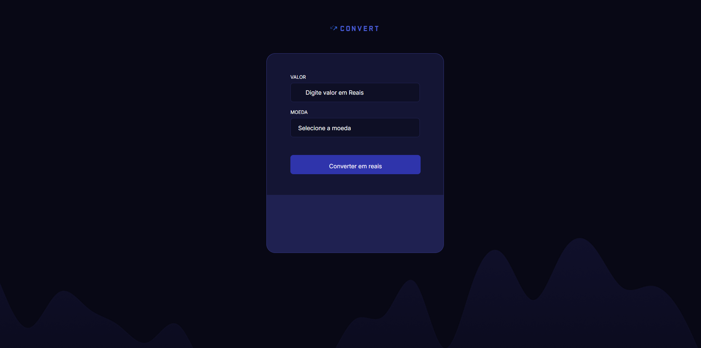

# Conversor de Moedas



Este projeto é um conversor de moedas que permite converter valores em reais (BRL) para outras moedas, como:

- Dólar (USD)
- Euro (EUR)
- Libra Esterlina (GBP)

## 🚀 Tecnologias Utilizadas

O projeto foi desenvolvido utilizando as seguintes tecnologias:

- **HTML** → Para estruturar a página.
- **CSS** → Para estilizar a interface e torná-la responsiva.
- **JavaScript** → Para realizar os cálculos de conversão e interagir com APIs de cotação de moedas.

## 📸 Print do Projeto

Adicione um print do projeto aqui para ilustrar como ele funciona.

## 📌 Funcionalidades

- Conversão de valores em tempo real.
- Interface simples e intuitiva.
- Atualização automática da cotação com APIs de câmbio.

## 📥 Como Usar

1. Clone o repositório:
   ```bash
   git clone https://github.com/deivid94/conversor_de_moedas

2. Abra o index.html com o liveServer

3. Digite o valor que deseja converter e a moeda.

## 🛠 Melhorias Futuras

- Adicionar mais moedas.